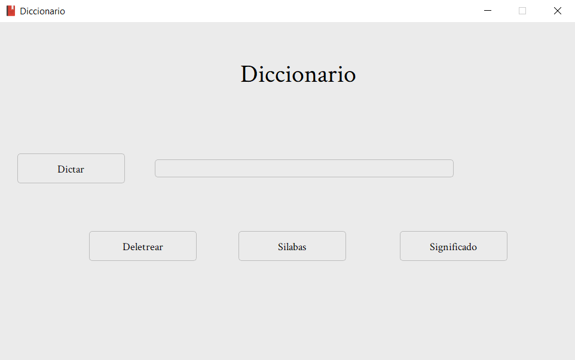

<h1>Dictionary</h1>

 
 
 
 

<h3>About</h3>

Application focused on searching the meaning of words through web scraping, besides having more functions such as Dictation, Spelling and Syllables. 
I created this application as a way to test the knowledge that I have started to acquire so I decided to make this dictionary with some basic functions like spelling but from there more ideas came up, like implementing a method that would tell me the meanings of the words that I didn't understand, or a way in which I didn't have to write the word and just by telling the computer I could write it. When I created this application I was just starting to learn Python (it is the language I used for this application) so I may have a lot of bad practices in the code that I am correcting for future versions. During the creation of this application I learned how to make user interfaces, I dabbled a bit in web scraping and besides investigating a method with which I can change text to sound and play it also at the end I used object oriented programming to facilitate the creation of the interface.

---

<h3>Functions</h3>
<h4>Dictate</h4>

For the creation of the dictation function I looked for a way to access the device's microphone. For this I relied on the <a href="https://pypi.org/project/SpeechRecognition/">speech_recognition</a> library which listens through the microphone and then converts the audio to text.
Then I store the text in a variable and insert it into the bar so that the user can apply any of the other functions on the collected text. You can see all this in the line 9 and in the dictate function inside the code. 

<h4>Spell</h4>

The function of spelling I made it with a for loop, by means of which I iterate the word received in the bar. When iterating I store the word letter by letter and when we detect a space within the string we ask it to tell us the complete word and so repeatedly until spelling all the text entered in the bar.
You can see more in the spell function at line 47 of the code

<h4>Syllables</h4>

In order to make the syllables function I decided to use POO since at that time it was the subject I was looking at and it would make it easier for me to create buttons, plus it was a way to test the knowledge I had acquired. This function and the whole interface was made with the <a href="https://docs.python.org/3/library/tkinter.html">tkinter</a> library as well as <a href="https://pypi.org/project/pyttsx3/">pyttsx3</a> for text-based sound playback. You can see more from line 61 of the code

<h4>Meaning</h4>

The meaning function was a bit more difficult since I had to do some research and learn a bit of webscraping to make it work, but in the end I managed to find a method with which I could get the result I wanted for this I used the <a href="https://dem.colmex.mx/">DEM</a> dictionary because it has a little simpler definition and examples, I also relied on the <a href="https://pypi.org/project/beautifulsoup4/">BeautifulSoup</a> library and <a href="https://docs.python-requests.org/en/latest/">request</a> to get the text of the results of the dictionary. I leave the webscraping.py file so you can see in an easier way how I did the webscraping part.

---

<h3>Requirements</h3>

To have a good performance of the application I recommend downloading "Microsoft Sabina Desktop - Spanish (Mexico)" which is a voice provided by Microsoft for the devices. 
<h3>How to download "Microsoft Sabina Desktop - Spanish (Mexico)".</h3>
In order to download the necessary voice for the program, the first thing to do is to go to:

- Settings

- Time and language

- Voice

- Manage voices

- Add voices

In the search bar type Spanish and download the one that says "Spanish (Mexico)". And with that, everything would be ready to use the application correctly and avoid any pronunciation error. 

 
**If you want to download the dependencies to be able to edit the code use the command:**

    py pip install -r requirements.txt
 
---

<h3>Contribution</h3>

Pull requests are welcome, I would appreciate your support to contribute to a better development of this application. For major changes, please open an issue to discuss what you would like to change.

